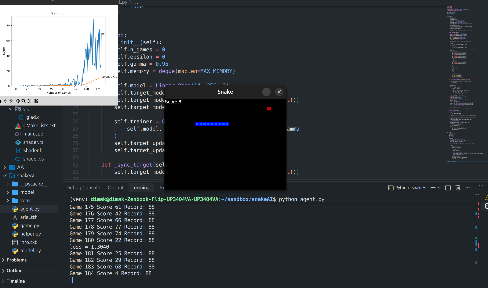

## Snake AI using Deep Q learning

Основано на туториале от Patrick Loeber
Использовался PyTorch


Для получения более стабильных результатов использовал BSD для нахождения свободных ячеек слева, справа и спереди змейки - где их количество больше, туда и идти, добавилась балансировка в reward - за приближение к яблоку награда увеличивается, добавил Target Network

## Что внутри
- `game.py` — среда (Pygame)
- `model.py` — Q-сеть и тренер
- `agent.py` — агент с replay memory и target network
- `helper.py` — графики обучения

## Установка
```bash
python -m venv venv
source venv/bin/activate    # Windows: venv\Scripts\activate
pip install -r requirements.txt
```

## Запуск
```bash
python agent.py
```

## Результат
- 166 игр → рекорд 88 яблок

